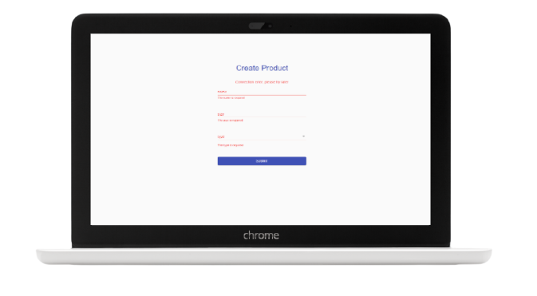

# **TDD Form with an API Request**

This project is part of the
[**Test Driven Development (TDD) en React JS**](https://www.udemy.com/course/tdd-react-js/?referralCode=F40803D2C4D2934AB038)
course.

This form has been developed applying Test Driven Development with
[](https://es.reactjs.org/),
[](https://jestjs.io/),
[](https://testing-library.com/),
[](https://mswjs.io/)
and
[](https://material-ui.com/)

**NOTE:** a [**mock server**](https://mswjs.io/) and an API rest have been used
to develop this exercise.

## **Quick start guide**

Instructions to start this project:

### Installation

- Clone repository:

```
git clone [repository]
```

- Install NPM packages and dependencies:

```
npm install
```

- Run project on local server

```
npm start
```

- [**Project URL**](https://anaguerraabaroa.github.io/react-tdd-form/) is also
  available on GitHub Pages.

### Tests

- Run tests:

```
npm run test
```

## **Features and usage**

**Store product**

As a merchandise manager, I want to store new products as a way of
administrating my products.

**Acceptance Criteria**

1. There must be a create product form page.

2. The form must have the following fields: name, size, type (electronic,
   furniture, clothing) and a submit button.

```javascript
describe('when the form is mounted', () => {
  it('there must be a create product form page', () => {
    expect(
      screen.getByRole('heading', {name: /create product/i}),
    ).toBeInTheDocument()
  })

  it('should exists the fields: name, size, type (electronic, furniture, clothing)', () => {
    expect(screen.getByLabelText(/name/i)).toBeInTheDocument()
    expect(screen.getByLabelText(/size/i)).toBeInTheDocument()
    expect(screen.getByLabelText(/type/i)).toBeInTheDocument()

    expect(screen.queryByText(/electronic/i)).toBeInTheDocument()
    expect(screen.queryByText(/furniture/i)).toBeInTheDocument()
    expect(screen.queryByText(/clothing/i)).toBeInTheDocument()
  })

  it('should exists the submit button', () => {
    expect(screen.getByRole('button', {name: /submit/i})).toBeInTheDocument()
  })
})
```

3. All the fields are required.

- If the user leaves empty fields and clicks the submit button, the form page
  must display required messages as the format: _“The [field name] is required”_
  aside of the proper field.

  ```javascript
  describe('when the user submits the form without values', () => {
    it('should display validation messages', async () => {
      expect(
        screen.queryByText(/the name is required/i),
      ).not.toBeInTheDocument()
      expect(
        screen.queryByText(/the size is required/i),
      ).not.toBeInTheDocument()
      expect(
        screen.queryByText(/the type is required/i),
      ).not.toBeInTheDocument()

      fireEvent.click(screen.getByRole('button', {name: /submit/i}))

      expect(screen.queryByText(/the name is required/i)).toBeInTheDocument()
      expect(screen.queryByText(/the size is required/i)).toBeInTheDocument()
      expect(screen.queryByText(/the type is required/i)).toBeInTheDocument()

      await waitFor(() =>
        expect(
          screen.getByRole('button', {name: /submit/i}),
        ).not.toBeDisabled(),
      )
    })
  })
  ```

- If the user blurs a field that is empty, then the form must display the
  required message for that field.

  ```javascript
  describe('when the user blurs an empty field', () => {
    it('should display a validation error message for the input name', () => {
      expect(
        screen.queryByText(/the name is required/i),
      ).not.toBeInTheDocument()

      fireEvent.blur(screen.getByLabelText(/name/i), {
        target: {name: 'name', value: ''},
      })

      expect(screen.queryByText(/the name is required/i)).toBeInTheDocument()
    })

    it('should display a validation error message for the size name', () => {
      expect(
        screen.queryByText(/the size is required/i),
      ).not.toBeInTheDocument()

      fireEvent.blur(screen.getByLabelText(/name/i), {
        target: {name: 'size', value: ''},
      })

      expect(screen.queryByText(/the size is required/i)).toBeInTheDocument()
    })
  })
  ```

4. The form must send the data to a backend endpoint service.

- The submit button should be disabbled while the form page is fetching the
  data. After fetching, the submit button does not have to be disabled.

- In the success path, the form page must display the success message _“Product
  stored”_ and clean the fields values.

```javascript
describe('when the user submits the form properly and the server returns created status', () => {
  it('should the submit button be disabled until the request is done', async () => {
    const submitBtn = screen.getByRole('button', {name: /submit/i})
    expect(submitBtn).not.toBeDisabled()

    fireEvent.click(submitBtn)

    expect(submitBtn).toBeDisabled()

    await waitFor(() => expect(submitBtn).not.toBeDisabled())
  })

  it('the form page must display the success message "Product stored" and clean the fields values', async () => {
    const nameInput = screen.getByLabelText(/name/i)
    const sizeInput = screen.getByLabelText(/size/i)
    const typeSelect = screen.getByLabelText(/type/i)

    fireEvent.change(nameInput, {
      target: {name: 'name', value: 'my product'},
    })
    fireEvent.change(sizeInput, {
      target: {name: 'size', value: '10'},
    })
    fireEvent.change(typeSelect, {
      target: {name: 'type', value: 'electronic'},
    })

    fireEvent.click(screen.getByRole('button', {name: /submit/i}))

    await waitFor(() =>
      expect(screen.getByText(/product stored/i)).toBeInTheDocument(),
    )

    expect(nameInput).toHaveValue('')
    expect(sizeInput).toHaveValue('')
    expect(typeSelect).toHaveValue('')
  })
})
```

- In a server error, the form page must display the error message _“Unexpected
  error, please try again”_.

  ```javascript
  describe('when submits the form and the server returns an unexpected error', () => {
    it('the form page must display the error message "Unexpected error, please try again"', async () => {
      fireEvent.click(screen.getByRole('button', {name: /submit/i}))

      await waitFor(() =>
        expect(
          screen.getByText(/unexpected error, please try again/i),
        ).toBeInTheDocument(),
      )
    })
  })
  ```

- In the invalid request path, the form page must display the error message
  _“The form is invalid, the fields [field1...fieldN] are required”_.

  ```javascript
  describe('when submits the form and the server returns an invalid request error', () => {
    it('the form page must display the error message "The form is invalid, the fields name, size, type are required"', async () => {
      server.use(
        rest.post('/products', (req, res, ctx) => {
          return res(
            ctx.status(INVALID_REQUEST_STATUS),
            ctx.json({
              message:
                'The form is invalid, the fields name, size, type are required',
            }),
          )
        }),
      )

      fireEvent.click(screen.getByRole('button', {name: /submit/i}))

      await waitFor(() =>
        expect(
          screen.getByText(
            /the form is invalid, the fields name, size, type are required/i,
          ),
        ).toBeInTheDocument(),
      )
    })
  })
  ```

- In the not found service path, the form page must display the message
  _“Connection error, please try later”_.

  ```javascript
  describe('when submits the form and the server returns a not found service error', () => {
    it('the form page must display the message "Connection error, please try later"', async () => {
      server.use(
        rest.post('/products', (req, res) =>
          res.networkError('Failed to connect'),
        ),
      )

      fireEvent.click(screen.getByRole('button', {name: /submit/i}))

      await waitFor(() =>
        expect(
          screen.getByText(/connection error, please try later/i),
        ).toBeInTheDocument(),
      )
    })
  })
  ```

## **Folder Structure**

```
React TDD Form with an API Request
├── docs
├── node_modules
├── public
├── src
│    ├── const
│    │   └── httpStatus.js
│    ├── form
│    │   ├── Form.js
│    │   └── Form.test.js
│    ├── images
│    │   └── form.png
│    ├── services
│    │   └── productServices.js
│    ├── App
│    │── index.js
│    └── setupTests.js
|── .eslintrc
├── .gitignore
├── .prettierrc
├── LICENSE
├── package-lock.json
├── package.json
└── README.md
```

## **License**

This project is licensed under

